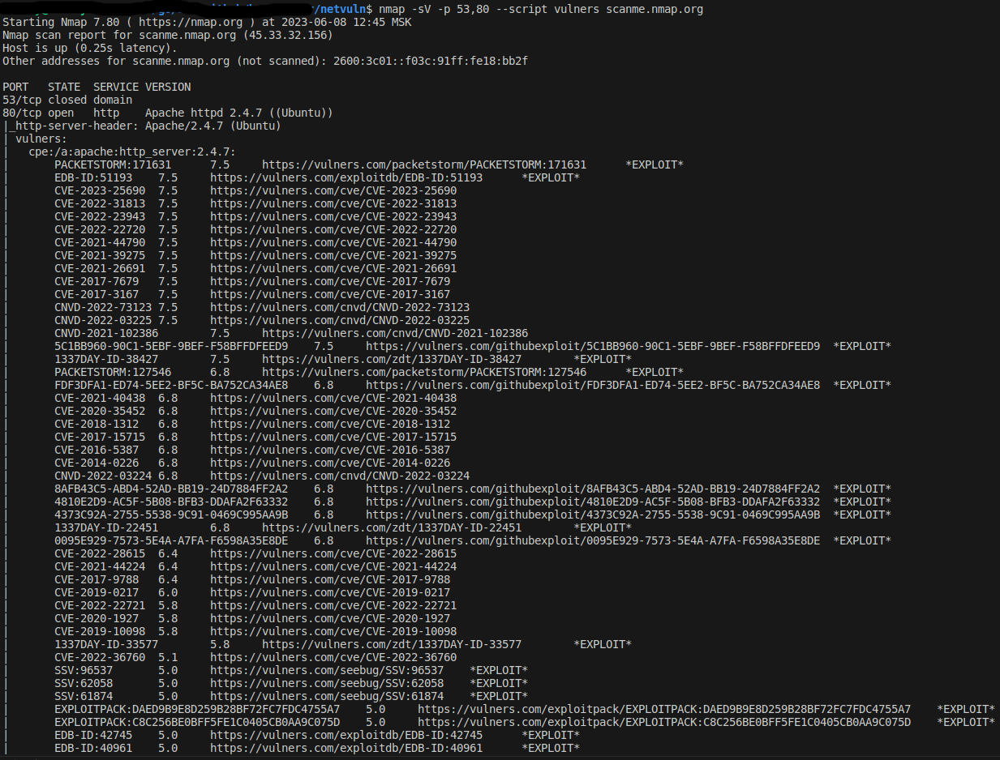
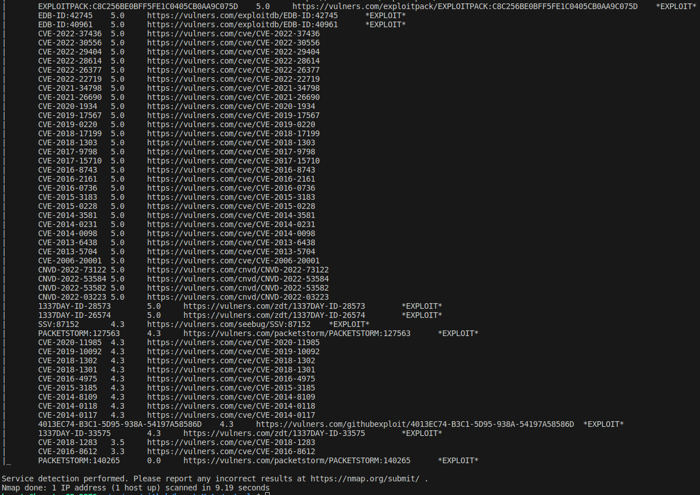

## Netvuln
---

The repository contains a [gRPC](https://grpc.io/docs/languages/go/) wrapper over [Nmap](https://nmap.org/) using [vulners](https://github.com/vulnersCom/nmap-vulners) scrypt to detect vulnerabilities.
Wrapper is a [service](netvuln.v1/netvuln.proto) - gRPC endpoint, which returns a list of found vulnerabilities for each host.

For the service to work, nmap must be installed. You can install it by following [the instructions](https://nmap.org/download.html).

To build the binary file use the command:

``` bash
make build
```

The binary file will be saved to the `bin/` folder.
To run the program on Linux, you can use the following command (from the root directory of the repo):

```bash
./bin/netvuln
```

Service configurations can be changed using environment variables.
The service supports the following environment variables:
- `LOG_LVL` - determine the logging level. Can be one of the following values (case insensitive):
    - `PANIC`
	- `FATAL`
	- `ERROR`
	- `WARN` or `WARNING`
	- `INFO`
	- `DEBUG`
	- `TRACE`

 When you select a specific logging level, all events of this level and higher in severity are logged. 
 If the logging level is incorrect, the standard `INFO` level will be used:


- `SRV_ADDR` - the address of the service on which it will be launched.
The default address is `:9000`.

For example, to start a service with logging level `DEBUG` and higher on localhost on port `8000`, you need to use the following command:
```bash
LOG_LVL=DEBUG SRV_ADDR=:8000 ./bin/netvuln
```

To run the tests, you can use the command:
```bash
make test
```

To run the linter, you can use the command:
```bash
make lint
```
[`golangci-lint`](https://github.com/golangci/golangci-lint) is used as a linter.
If the linter is not installed on your machine, you can install it by following [the instructions](https://golangci-lint.run/usage/install/).

---
### Example:
The repo contains an [example client](examples/request_scanme.go) to interact with the service.
You can run the example with the following code:
```go
import (
	"github/bountyHntr/netvuln/examples"
)

func main() {
	examples.RequestScanme()
}
```

At the time of writing the documentation, the result of executing the examples was as follows:


The result of executing a similar nmap command from the Linux console:


